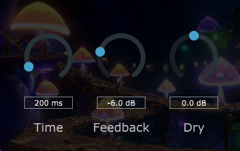

# HayesDelay
A simple feedback delay audio plug-in. 
It creates a circular delay buffer that is written to by the main buffer and then read back from at some time parameter in the past.
With it, users can create longlasting echo chains.
Written with JUCE.

